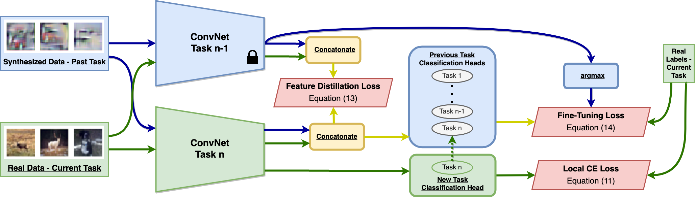

## Always Be Dreaming: A New Approach for Class-Incremental Learning



An unofficial PyTorch implementation of ABD introduced in the following paper:

> [James Smith](https://jamessealesmith.github.io), Yen-Chang Hsu, Jonathan Balloch, Yilin Shen, Hongxia Jin, Zsolt Kira
>
> Always Be Dreaming: A New Approach for Data-Free Class-Incremental Learning
>
> International Conference on Computer Vision (ICCV), 2021.

This repo is based on [cl-lite](https://github.com/gqk/cl-lite), see [Experiment](#experiment) for usage.

The official code can be found in [AlwaysBeDreaming-DFCIL](https://github.com/GT-RIPL/AlwaysBeDreaming-DFCIL).

## Experiment

- Install dependencies

    ```shell
    pip install -r requirements.txt
    ```
- Prepare datasets

    1. create a dataset root diretory, e.g., data
    2. cifar100 will be automatically downloaded
    3. download and unzip [tiny-imagenet200](http://cs231n.stanford.edu/tiny-imagenet-200.zip) to dataset root diretory
    4. follow [PODNet](https://github.com/arthurdouillard/incremental_learning.pytorch/tree/master/imagenet_split) to prepare imagenet100 dataset
    5. the overview of dataset root diretory

        ```shell
        ├── cifar100
        │   └── cifar-100-python
        ├── imagenet100
        │   ├── train
        │   ├── train_100.txt
        │   ├── val
        │   └── val_100.txt
        └── tiny-imagenet200
            ├── test
            ├── train
            ├── val
            ├── wnids.txt
            └── words.txt
        ```

- Generate config file (replace `<root>` with your dataset root path)

    ```shell
    python main.py --data.root <root> --print_config > cifar100.yaml
    ```

- Run experiment

    ```shell
    python main.py --config cifar100.yaml
    ```

We provide [configs](./config) and [Makefile](./Makefile) to quickly reproduce the ten-tasks experimental results reported in the paper, run the following command if the `make` has been installed:

```shell
make cifar100
make tiny-imagenet200
make imagenet100
```

Modify fields (e.g., `num_tasks`) in the config files to reproduce other experiments.

## Citation

```
@inproceedings{smith2021always,
  title={Always be dreaming: A new approach for data-free class-incremental learning},
  author={Smith, James and Hsu, Yen-Chang and Balloch, Jonathan and Shen, Yilin and Jin, Hongxia and Kira, Zsolt},
  booktitle={Proceedings of the IEEE/CVF International Conference on Computer Vision (ICCV)},
  pages={9374--9384},
  year={2021}
}

@inproceedings{gao2022rdfcil,
    title = {R-DFCIL: Relation-Guided Representation Learning for Data-Free Class Incremental Learning},
    author = {Qiankun Gao, Chen Zhao, Bernard Ghanem, Jian Zhang},
    booktitle = {European Conference on Computer Vision (ECCV)},
    year = {2022}
}
```
